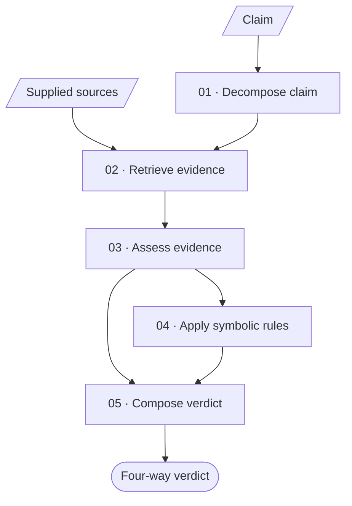

<p align="center">
  
</p>

# VeriNICE

VeriNICE (**Verification via Neuro-symbolic Inference with Compositional
Evidence**) is an inspectable claim-verification demonstrator. Given a claim
and supplied source documents, it decomposes the claim, retrieves relevant
passages, assesses their relations to each atomic claim, applies eligible
symbolic rules, and deterministically composes a four-way verdict:
`SUPPORTED`, `REFUTED`, `NOT_ENOUGH_EVIDENCE`, or `CONFLICTING_EVIDENCE`.

Verdict-bearing support and refutation remain traceable to exact source spans
or to deterministic checks over source-linked premises. Reference verdicts are
shown only for comparison and never enter inference.

## Pipeline



Hybrid retrieval combines semantic similarity from normalized BGE embeddings
with lexical matching through reciprocal-rank fusion. Evidence is assessed per
atomic claim, and support or refutation affects the verdict only when its
evidence bundle is sufficient. When a symbolic comparison is applicable, the
model proposes a mapping among server-issued candidates and premises; Python
validates the operands and executes the rule deterministically.

## Demonstration modes

| Mode | Description |
| --- | --- |
| **Local live mode** | Runs the complete pipeline locally with Ollama, BGE, FastAPI, and Next.js. |
| **Recorded walkthrough** | Replays the 18 prepared showcase runs at `/walkthrough` without live inference. |

## Quick start

Requirements: Python 3.11 or 3.12, Node.js/npm, and Ollama. Run commands from
the repository root.

```bash
./run-verigraph --check
./run-verigraph --prepare
./run-verigraph --start
```

Open [http://localhost:3000](http://localhost:3000). Preparation installs the
pinned dependencies, downloads `BAAI/bge-small-en-v1.5` into the ignored
`data/models/` directory, and pulls `qwen2.5:7b` through Ollama.

See the [operations guide](docs/RUN_GUIDE.md) for testing, recording the
walkthrough, model overrides, API endpoints, and Vercel configuration.

## Showcase data

The showcase contains 18 qualitative examples: 15 authored, source-grounded
cases across five subject categories and three cases derived from
[AVeriTeC](https://github.com/MichSchli/AVeriTeC). The examples exercise
multi-part claims, direct and conflicting evidence, source-scope filtering,
symbolic comparisons, and abstention. Publisher, source URL, retrieval date,
extraction offsets, and content hashes are retained for traceability.

The showcase demonstrates the implemented workflow; it is not presented as an
accuracy, usability, or generalisation benchmark.

## Documentation

- [Running VeriNICE](docs/RUN_GUIDE.md)
- [Neural components](docs/NEURAL_COMPONENTS.md)
- [Symbolic reasoning](docs/SYMBOLIC_REASONING.md)

## Licences

VeriNICE code is released under the [MIT License](LICENSE). AVeriTeC is
licensed under [CC BY-NC 4.0](https://creativecommons.org/licenses/by-nc/4.0/).
Source excerpts remain subject to their publishers' rights and include links
to the original pages and traceability metadata.
