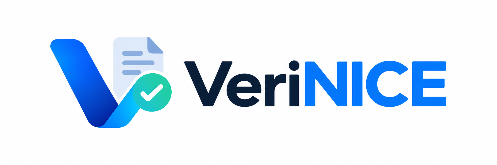
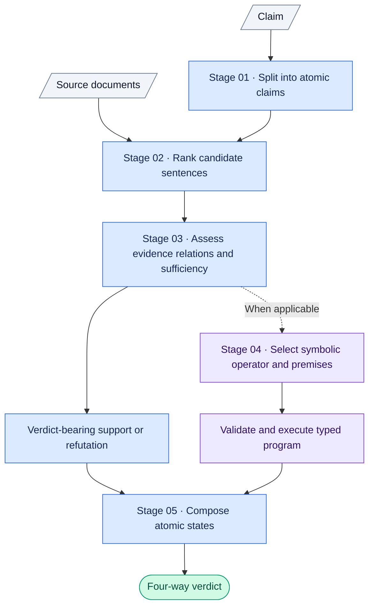

<p align="center">
  
</p>

# VeriNICE

VeriNICE (**Verification via Neuro-symbolic Inference with Compositional
Evidence**) is an inspectable claim-verification demonstrator. Given a claim
and supplied source documents, it decomposes the claim into atomic claims,
ranks candidate evidence, assesses evidence relations and sufficiency, performs
symbolic reasoning, and deterministically
composes a four-way verdict: `SUPPORTED`, `REFUTED`,
`NOT_ENOUGH_EVIDENCE`, or `CONFLICTING_EVIDENCE`.

Every verdict-bearing support or refutation is traceable either to an exact
source span or to a symbolic program executed over source-linked premises.
Dataset reference verdicts are displayed only for comparison and never enter
the inference pipeline.

## Pipeline



Hybrid retrieval is the default. It combines semantic BGE similarity with
lexical matching of terms, names, dates, and numbers using reciprocal rank
fusion. Explicit jurisdiction mismatches remain visible for inspection but are
excluded from evidence assessment, symbolic reasoning, and verdict
composition.

The symbolic-reasoning stage uses a small operator library. Qwen2.5 maps source evidence to a predefined comparison rule. Python then checks that the required values and evidence references are present before executing the rule. If the evidence cannot support a valid comparison, the check remains unresolved and does not affect the verdict.

## Demonstration modes


| Mode                     | Description                                                                      |
| -------------------------- | ---------------------------------------------------------------------------------- |
| **Local live demo**      | Runs the complete verification pipeline locally using Ollama, BGE, and Python.   |
| **Recorded walkthrough** | Replays the 18 showcase runs without live inference; available at`/walkthrough`. |

## Run locally

Requirements: Python 3, Node.js/npm, and Ollama Desktop. Run commands from the
`verigraph/` directory.

```bash
./run-verigraph --check
./run-verigraph --prepare  # one-time dependencies and model downloads
./run-verigraph --start
```

Open [http://localhost:3000](http://localhost:3000). The Next.js frontend
proxies requests to FastAPI on port 8001. Preparation installs the pinned
Python and Node dependencies, downloads `BAAI/bge-small-en-v1.5` into the
gitignored `data/models/` directory, and pulls `qwen2.5:7b` through Ollama.
After preparation, live inference runs locally without fetching documents or
models.

To use a different Ollama model:

```bash
VERIGRAPH_OLLAMA_MODEL=qwen2.5:3b ./run-verigraph --start
```

Changing the model may change decomposition and will not reproduce the
recorded walkthrough. Additional maintenance commands are:

```bash
./run-verigraph --test
./run-verigraph --record-walkthrough
```

The recorder requires a healthy local stack and updates the recorded assets
for all 18 showcase cases.

## Demo data

The showcase contains **18 qualitative examples**:

- **15 authored, source-grounded cases** across Science, History, Geography,
  Technology, and Current Affairs. They cover familiar facts and myths,
  multi-part claims, numeric and temporal comparisons, conflicting sources,
  and cases where the system should abstain. Each case contains two contiguous,
  sentence-complete excerpts of 150–400 words from linked authoritative
  sources.
- **3 AVeriTeC cases.** [AVeriTeC](https://github.com/MichSchli/AVeriTeC) is a
  dataset for verifying real-world claims using evidence from the open web.
  The selected cases illustrate direct numeric and temporal evidence (pandemic
  job recovery), jurisdiction filtering (wildfire smoke and orange skies), and
  insufficient evidence for an attributed causal claim (non-COVID deaths and
  hospital closures).

The showcase is designed to demonstrate inspectability and failure handling;
it is not presented as a benchmark result. Publisher, source URL, retrieval
date, extraction offsets, and content hashes are retained for traceability.

## Licences

VeriNICE code is released under the [MIT License](LICENSE). AVeriTeC is
licensed under [CC BY-NC 4.0](https://creativecommons.org/licenses/by-nc/4.0/).
Source excerpts remain subject to their publishers' rights and are accompanied
by links to the original pages and traceability information.

## Documentation

- [Pipeline and API reference](PIPELINE.md)
- [Local operation and demonstration guide](RUNGUIDE.md)
- [AAAI Demonstrations Program positioning](AAAI27_DEMO.md)
