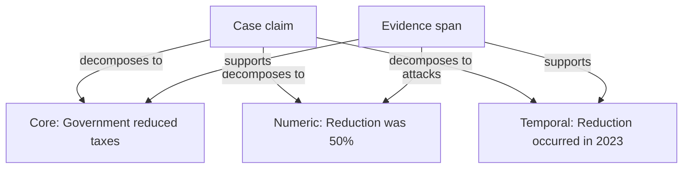

# VeriGraph Argumentation Graph Implementation Plan

## Scope

This plan covers the third implementation stage, after structured claim decomposition and linguistic-analysis integration are stable.

The objective is to replace the current presentation-only graph with a deterministic, ARGUS-inspired argumentation graph that:

- Represents the case claim, typed verification obligations, and retrieved evidence
- Connects evidence to obligations with support or attack relations derived from NLI
- Exposes compact linguistic metadata on obligation nodes
- Preserves source provenance and exact evidence offsets
- Provides one clear graph view in the demo interface
- Creates a stable foundation for later four-way verdict aggregation

This stage must not add a second expanded graph, perform new argument extraction, infer cross-evidence relations, or calculate the final case verdict.

## Prerequisites

Begin this stage only when:

- Claim decomposition schema version 2 is stable.
- Each verification obligation has a stable ID, type, text, source text, and source offsets.
- Claim composition is represented as `SINGLE`, `AND`, or `OR`.
- The linguistic-analysis endpoint returns compact summaries keyed by obligation ID.
- Retrieved evidence has stable document and sentence identifiers.
- NLI results retain labels and class probabilities for every evaluated obligation-evidence pair.
- All 22 recorded demo cases have compatible decomposition and linguistic-analysis fixtures.

## Target graph

Use one visible graph with three node types and three edge types.



The graph is inspired by ARGUS at the conceptual level:

- The case claim is the major claim.
- Verification obligations are intermediate claims.
- Evidence sentences are premises.
- NLI entailment and contradiction become support and attack relations.

VeriGraph does not need to reproduce the full ARGUS extraction pipeline or ontology. Its graph must remain tailored to fact verification and the data already produced by the pipeline.

## Design principles

1. Maintain one graph representation in the interface.
2. Treat Qwen verification obligations as graph claims.
3. Treat retrieved sentences as evidence premises.
4. Derive support and attack edges only from stored NLI results.
5. Do not convert `NEUTRAL` results into visible argument edges.
6. Attach linguistic summaries to obligation nodes as metadata.
7. Do not create separate graph nodes for subjects, predicates, dates, numbers, or other linguistic features.
8. Preserve enough provenance to explain every node and edge.
9. Build the graph deterministically without an additional LLM call.
10. Keep graph construction in the frontend during this visualization stage.
11. Move construction to FastAPI only when the graph becomes a formal backend output used for verdict aggregation or export.
12. Keep all current pipeline outputs available even when a relation is omitted from the visible graph.

## 1. Define the graph contract

Create a versioned TypeScript contract for the graph rather than passing loosely structured visualization objects between components.

### Graph envelope

```ts
interface ArgumentationGraph {
  schemaVersion: 2;
  claimId: string;
  nodes: ArgumentationNode[];
  edges: ArgumentationEdge[];
  warnings: GraphWarning[];
  stats: GraphStats;
}
```

### Node types

```ts
type ArgumentationNodeType =
  | "CASE_CLAIM"
  | "VERIFICATION_OBLIGATION"
  | "EVIDENCE";
```

Use a discriminated union so each node type has an explicit payload.

```ts
interface CaseClaimNode {
  id: string;
  type: "CASE_CLAIM";
  text: string;
  composition: "SINGLE" | "AND" | "OR";
}

interface VerificationObligationNode {
  id: string;
  type: "VERIFICATION_OBLIGATION";
  atomId: string;
  text: string;
  role: VerificationRole;
  sourceText: string;
  sourceStart: number;
  sourceEnd: number;
  linguistic?: ObligationLinguisticSummary;
}

interface EvidenceNode {
  id: string;
  type: "EVIDENCE";
  evidenceId: string;
  documentId: string;
  documentTitle: string;
  documentUrl: string;
  text: string;
  start: number;
  end: number;
  retrievalScore: number;
  bestRank: number;
}

type ArgumentationNode =
  | CaseClaimNode
  | VerificationObligationNode
  | EvidenceNode;
```

### Verification roles

Reuse the role vocabulary from decomposition:

```ts
type VerificationRole =
  | "CORE"
  | "NUMERIC_CONSTRAINT"
  | "TEMPORAL_CONSTRAINT"
  | "ATTRIBUTION"
  | "LOCATION_CONSTRAINT"
  | "CAUSAL_RELATION"
  | "CONDITIONAL"
  | "MODALITY_CONSTRAINT";
```

Do not create additional graph node types for these roles. Display the role as a badge on the obligation node.

## 2. Define the edge contract

### Edge types

```ts
type ArgumentationEdgeType =
  | "DECOMPOSES_TO"
  | "SUPPORTS"
  | "ATTACKS";
```

### Edge model

```ts
interface ArgumentationEdge {
  id: string;
  source: string;
  target: string;
  type: ArgumentationEdgeType;
  confidence?: number;
  nli?: {
    label: "ENTAILMENT" | "CONTRADICTION";
    probabilities: {
      entailment: number;
      contradiction: number;
      neutral: number;
    };
    modelId: string;
  };
}
```

### Direction

Use consistent edge direction:

| Relation | Source | Target |
| --- | --- | --- |
| `DECOMPOSES_TO` | Case claim | Verification obligation |
| `SUPPORTS` | Evidence | Verification obligation |
| `ATTACKS` | Evidence | Verification obligation |

This direction presents evidence as the premise acting on the proposition being verified.

### NLI mapping

| NLI label | Graph result |
| --- | --- |
| `ENTAILMENT` | Create a `SUPPORTS` edge |
| `CONTRADICTION` | Create an `ATTACKS` edge |
| `NEUTRAL` | Do not create a visible edge |

Neutral classifications must remain available in the evidence detail view and stored pipeline results. Omitting them from the graph is a visualization decision, not deletion of data.

## 3. Implement a deterministic graph builder

Create a pure builder function in `frontend/lib/argumentationGraph.ts`.

```ts
function buildArgumentationGraph(
  claim: CaseClaim,
  decomposition: ClaimDecompositionV2,
  retrievedEvidence: RetrievedEvidence[],
  nliResults: NliResult[],
  documents: SourceDocument[],
  linguisticSummaries: ObligationLinguisticSummary[]
): ArgumentationGraph;
```

The builder must perform these steps in order:

1. Validate the schema version and claim ID.
2. Create exactly one case-claim node.
3. Create one obligation node for each normalized atom.
4. Create one `DECOMPOSES_TO` edge for each obligation.
5. Index documents, evidence, NLI results, and linguistic summaries by stable ID.
6. Filter NLI results to entailment and contradiction.
7. Create each referenced evidence node once.
8. Create a support or attack edge for each eligible NLI result.
9. Attach a matching linguistic summary to each obligation when available.
10. Record nonfatal validation warnings.
11. Sort nodes and edges deterministically.
12. Return graph statistics.

Do not use an LLM, semantic heuristic, or spaCy rule inside this builder.

## 4. Define stable identity and deduplication

### Claim node ID

Derive the claim node ID from the case ID:

```text
claim:{claimId}
```

### Obligation node ID

Derive the obligation node ID from the claim and atom IDs:

```text
obligation:{claimId}:{atomId}
```

### Evidence node ID

Prefer an existing stable sentence ID. If unavailable, generate one during document segmentation using:

```text
evidence:{documentId}:{sentenceStart}:{sentenceEnd}
```

Do not use sentence text alone as an identifier.

### Edge ID

Construct a stable ID from the edge type and endpoint IDs:

```text
edge:{type}:{sourceId}:{targetId}
```

### Deduplication rule

The same evidence sentence must appear as one node even when it:

- Is retrieved for several obligations
- Supports more than one obligation
- Supports one obligation and attacks another
- Appears at different retrieval ranks for different obligations

Retain the best retrieval rank on the node. Keep relation-specific NLI results on the edges.

## 5. Attach linguistic information without expanding topology

The spaCy output should be present in the graph, but as metadata and visual cues on verification-obligation nodes.

### Compact summary

```ts
interface ObligationLinguisticSummary {
  atomId: string;
  analysisStatus: "complete" | "partial" | "unavailable";
  roleAudit: "MATCH" | "MISMATCH" | "INCONCLUSIVE";
  subjects: string[];
  predicates: string[];
  cueKinds: string[];
  modifierKinds: string[];
  entityLabels: string[];
  warnings: LinguisticWarning[];
}
```

### Graph presentation

Display linguistic information through:

- A role badge on each obligation node
- Small cue badges for important constraints such as numeric, temporal, modality, or attribution
- An amber warning indicator for mismatches or preservation warnings
- A short tooltip containing subject and predicate summaries
- A click action that opens the existing detailed linguistic-analysis panel

Do not add subject, predicate, modifier, number, date, or entity nodes in this stage. That would substantially increase graph density without improving the core verification explanation.

### Failure behavior

Missing or partial linguistic analysis must not prevent graph rendering. Render the obligation normally and show an unobtrusive unavailable or partial-analysis indicator.

## 6. Represent claim composition

Store `SINGLE`, `AND`, or `OR` on the case-claim node.

Display it as a small claim-level badge or explanatory label:

- `SINGLE`: one verification obligation
- `AND`: all obligations jointly express the claim
- `OR`: alternative obligations express the claim

Do not add logical operator nodes in this stage. Do not use composition to compute the verdict yet. The later aggregation stage can consume this metadata.

## 7. Preserve provenance and inspectability

Every visible graph element must be traceable to a pipeline output.

### Obligation provenance

Retain:

- Generated obligation text
- Exact source text copied from the original claim
- UTF-16 start and end offsets
- Qwen role
- Decomposition schema version
- Optional decomposition warnings

### Evidence provenance

Retain:

- Evidence sentence text
- Document ID
- Document title
- Source URL
- Exact document character offsets
- Retrieval score
- Best retrieval rank

### Relation provenance

Retain:

- NLI label
- All three NLI probabilities
- Model identifier
- Obligation ID
- Evidence ID

When an edge is selected, show enough information to explain why the edge exists without implying that the NLI model has performed formal logical proof.

## 8. Add graph validation and warnings

The builder should return warnings instead of failing the entire graph when recoverable inconsistencies are found.

### Warning codes

| Code | Trigger |
| --- | --- |
| `MISSING_LINGUISTIC_SUMMARY` | An obligation has no matching compact summary |
| `MISSING_EVIDENCE` | An NLI result references an unknown evidence item |
| `MISSING_OBLIGATION` | An NLI result references an unknown obligation |
| `DUPLICATE_NODE_ID` | Two graph inputs resolve to the same node ID |
| `DUPLICATE_EDGE_ID` | Two relations resolve to the same edge ID |
| `UNSUPPORTED_NLI_LABEL` | A label is outside the expected three-class vocabulary |
| `INVALID_SOURCE_OFFSETS` | Stored offsets do not match the associated text bounds |
| `EMPTY_OBLIGATION_TEXT` | An obligation has no usable display text |

Classify warnings as recoverable or fatal. A mismatched claim ID or unsupported graph schema version may be fatal. Missing optional linguistic metadata should be recoverable.

## 9. Calculate descriptive graph statistics

Add graph-level counts for the interface and debugging.

```ts
interface GraphStats {
  obligationCount: number;
  evidenceCount: number;
  supportEdgeCount: number;
  attackEdgeCount: number;
  omittedNeutralCount: number;
  obligationsWithoutArgumentEdges: number;
}
```

These statistics are descriptive only. They must not be presented as a verdict or confidence score.

## 10. Implement one three-tier interface

Retain a top-to-bottom layout:

1. Case claim
2. Verification obligations
3. Evidence sentences

Do not expose separate collapsed and expanded graph modes. Progressive detail should come from selection and side panels, not from a second topology.

### Claim node

Show:

- Claim text
- Composition badge
- Number of obligations

### Obligation node

Show:

- Short obligation text
- Role badge
- Optional linguistic cue badges
- Linguistic warning state
- Support and attack counts

### Evidence node

Show:

- Truncated sentence text
- Source title
- Best retrieval rank or score
- A mixed-relations indicator when the same sentence supports one obligation and attacks another

Do not create document nodes. Evidence can be visually grouped or labelled by document while retaining the three-node-type contract.

## 11. Define visual semantics

Use a consistent, accessible visual language:

| Element | Recommended treatment |
| --- | --- |
| `DECOMPOSES_TO` | Blue or neutral structural line |
| `SUPPORTS` | Green solid line with arrow |
| `ATTACKS` | Red solid line with arrow |
| Linguistic warning | Amber border or icon |
| Unselected context | Muted opacity, still readable |
| Selected node or edge | Strong outline and full opacity |

Do not rely on color alone. Each edge should have a text label, icon, line pattern, or accessible name that identifies its relation.

Add a compact legend for the three edge types and the linguistic-warning indicator.

## 12. Preserve and extend interactions

Retain existing atom selection and evidence highlighting behavior.

### Selecting an obligation

- Emphasize the selected obligation.
- Emphasize its incoming support and attack edges.
- Emphasize connected evidence nodes.
- Dim unrelated nodes and edges without hiding them.
- Update the evidence and linguistic panels to the selected obligation.

### Selecting evidence

- Emphasize all relations from that evidence node.
- Open the evidence detail panel.
- Show the complete sentence and document provenance.
- Highlight the exact source span using stored offsets.
- List all connected obligations and their NLI labels.

### Selecting an edge

- Show the complete NLI probability distribution.
- Show the model identifier.
- Show the linked evidence and obligation texts.
- Provide a clear route to the source-document context.

### Keyboard and screen-reader support

- Make every node and edge focusable.
- Use logical tab order from claim to obligations to evidence.
- Provide accessible names such as `Evidence supports numeric constraint`.
- Allow Enter or Space to activate details.
- Preserve visible focus indicators.

## 13. Handle dense and incomplete cases

The interface must remain usable for up to 12 obligations and up to 72 retrieved candidate relations before neutral filtering.

### Density controls

- Wrap obligations across rows when required.
- Group evidence visually by source document.
- Truncate node text with full text available on focus or selection.
- Route edges to reduce overlap.
- Keep a minimum click and focus target size.
- Use horizontal scrolling only as a last resort on narrow screens.

### Empty and partial states

Provide explicit states for:

- No decomposition available
- Decomposition available but retrieval not complete
- Retrieval complete but NLI not complete
- Only neutral evidence found
- Obligation has no argument edge
- Linguistic analysis unavailable
- One or more source offsets invalid

An obligation with only neutral candidates must remain visible. Label it as having no supporting or attacking evidence in the current retrieved set.

## 14. Keep construction in the frontend for this stage

Continue building the graph in the Next.js application while it remains a deterministic view over existing pipeline results.

This avoids introducing a new backend contract before graph semantics are stable.

### Move to FastAPI later when

- The graph becomes an input to verdict aggregation.
- Graph validation must be authoritative across clients.
- Graphs are stored, compared, or exported.
- xAIF or another interoperability format is added.
- Multiple clients need the same graph output.

At that point, port the pure builder rules to Python or define a shared schema with equivalent frontend and backend validation.

## 15. Update the frontend structure

Recommended changes:

```text
frontend/
  components/
    ArgumentationGraph.tsx
    ArgumentationGraphLegend.tsx
    ArgumentationGraphDetails.tsx
  lib/
    argumentationGraph.ts
    argumentationGraph.types.ts
    argumentationGraph.validation.ts
  tests/
    argumentationGraph.test.ts
    ArgumentationGraph.test.tsx
```

### Responsibilities

`argumentationGraph.types.ts`

- Versioned node, edge, warning, and statistics types

`argumentationGraph.ts`

- Pure deterministic graph construction
- Identity generation
- Evidence deduplication
- Stable ordering
- Statistics

`argumentationGraph.validation.ts`

- Input and graph invariant checks
- Recoverable and fatal warning creation

`ArgumentationGraph.tsx`

- Layout and rendering
- Selection state
- Keyboard behavior
- Responsive presentation

`ArgumentationGraphDetails.tsx`

- Selected node or edge details
- Provenance
- NLI probabilities
- Links to evidence and linguistic panels

Avoid placing graph derivation rules inside React rendering code.

## 16. Define deterministic ordering

Stable ordering is important for recorded demos and visual regression tests.

Use this order:

1. Claim node
2. Obligations in normalized decomposition order
3. Evidence grouped by document order
4. Evidence within a document by sentence start offset
5. Structural edges in obligation order
6. Argument edges by obligation order, relation type, evidence document order, and sentence offset

Do not sort evidence by fluctuating display dimensions or React render order.

## 17. Add unit tests for graph construction

Test the builder independently from rendering.

### Required fixtures

1. A single obligation with supporting evidence
2. Several typed obligations with support and attack edges
3. One evidence sentence connected to several obligations
4. One evidence sentence supporting one obligation and attacking another
5. An obligation with only neutral classifications
6. Missing linguistic analysis
7. Partial linguistic analysis with warnings
8. Missing evidence reference in an NLI result
9. Invalid source offsets
10. Duplicate input identifiers
11. The maximum of 12 obligations
12. Repeated construction producing identical node and edge order

### Core assertions

- Exactly one claim node exists.
- Every obligation has exactly one incoming `DECOMPOSES_TO` edge.
- Entailment creates `SUPPORTS`.
- Contradiction creates `ATTACKS`.
- Neutral creates no visible edge.
- Evidence nodes are deduplicated.
- NLI probabilities remain attached to their specific edge.
- Linguistic summaries attach by atom ID.
- Recoverable warnings do not prevent graph construction.

## 18. Add component and interaction tests

Test that the interface:

- Renders all three node types
- Labels all three edge types
- Shows role and composition badges
- Shows linguistic warnings without changing edge relations
- Opens evidence details from an evidence node
- Opens linguistic details from an obligation node
- Highlights exact source text when offsets are valid
- Preserves selection when the graph rerenders with equivalent data
- Supports keyboard navigation and activation
- Provides accessible names for nodes and edges
- Handles narrow screens and maximum-size fixtures

## 19. Validate all recorded demo cases

Run the graph builder and interface against all 22 offline AVeriTeC cases.

For each case, inspect:

- Obligation count and ordering
- Role badges
- Support and attack mappings
- Evidence deduplication
- Source labels and exact highlighting
- Neutral-only obligations
- Mixed support and attack evidence
- Linguistic warnings
- Layout readability
- Absence of runtime errors

This is product validation for the demo, not a benchmark evaluation.

Record any graph warning as a fixture issue or expected limitation so the live demonstration remains reproducible.

## 20. Acceptance criteria

The stage is complete when:

- The interface presents one three-tier argumentation graph.
- The graph contains exactly one case-claim node.
- Every normalized verification obligation appears as one typed node.
- Every obligation has one `DECOMPOSES_TO` edge from the claim.
- Every displayed evidence node has complete document provenance and valid offsets.
- NLI entailment creates support edges and contradiction creates attack edges.
- Neutral results do not create visible argument edges.
- The same evidence sentence appears only once in the graph.
- Linguistic summaries are available from obligation nodes as metadata and details.
- Linguistic warnings do not create or alter argument relations.
- Claim composition is visible but does not yet determine a verdict.
- Nodes and edges can be inspected with mouse and keyboard.
- The 22 recorded demo cases render reproducibly without blocking errors.
- Existing retrieval, NLI, evidence highlighting, and linguistic-detail behavior remains functional.
- No additional LLM call is introduced for graph construction.

## 21. Implementation order

Implement the work in this sequence:

1. Freeze graph schema version 2 and TypeScript types.
2. Add stable evidence identifiers if they are not already present.
3. Implement ID generation, validation, and warning codes.
4. Implement the pure graph builder.
5. Add builder unit tests.
6. Connect linguistic summaries to obligation nodes.
7. Refactor `ArgumentationGraph.tsx` to consume the versioned graph.
8. Add role, composition, cue, and warning badges.
9. Add edge and node detail interactions.
10. Add keyboard and accessibility behavior.
11. Add component and visual-regression tests.
12. Validate and tune layout across all 22 recorded cases.
13. Freeze the graph contract before beginning verdict aggregation.

## Deliverables

- Versioned TypeScript graph schema
- Deterministic frontend graph builder
- Graph validation and warning codes
- Evidence deduplication and stable identity rules
- ARGUS-inspired three-tier graph interface
- Linguistic metadata integration on obligation nodes
- Provenance and NLI detail views
- Unit, component, accessibility, and recorded-case tests
- Updated technical documentation for the graph contract

## Out of scope

Defer the following work to later stages:

- Four-way verdict aggregation
- Formal argument-strength calculation
- Automatic resolution of conflicting evidence
- Cross-sentence or cross-document relation mining
- Evidence-side spaCy analysis
- Separate nodes for linguistic features
- Logical operator nodes
- A second expanded graph view
- Backend graph persistence
- xAIF export
- Full ARGUS argument extraction
- Replacement of Qwen claim decomposition

## Next stage

After this plan is complete and the graph contract is stable, prepare the verdict-aggregation plan. That stage should define how obligation-level support, attack, absence of evidence, claim composition, and conflicting evidence combine into the four AVeriTeC labels without conflating NLI confidence with case-level certainty.
