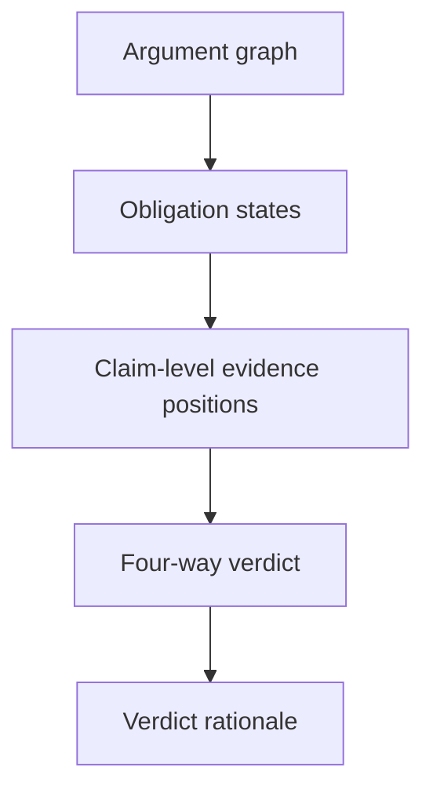

# VeriGraph Four-Way Verdict Aggregation Plan

> **Status: delivered.** This plan is kept as the design record for the stage. Current behaviour is documented in `PIPELINE.md`; the implementation is in `backend/verigraph_backend/verdict_aggregation.py`.

## Scope

This plan covers the fourth implementation stage, after structured claim decomposition, linguistic-analysis integration, and argumentation-graph construction are stable.

The objective is to convert the completed argument graph into one transparent case-level verdict:

- `SUPPORTED`
- `REFUTED`
- `NOT_ENOUGH_EVIDENCE`
- `CONFLICTING_EVIDENCE`

The aggregation layer should explain how evidence relations combine across verification obligations. It should not introduce another LLM call or hide the decision behind an opaque classifier.

This plan is designed for the AAAI-27 demo and the current offline set of 22 AVeriTeC development cases. It prioritizes inspectability, deterministic behavior, and a clear interface over benchmark optimization.

## Prerequisites

Begin this stage only when:

- Claim decomposition schema version 2 is frozen.
- Every verification obligation has a stable ID and role.
- Claim composition is available as `SINGLE`, `AND`, or `OR`.
- The argument graph contains stable claim, obligation, and evidence nodes.
- NLI entailment and contradiction are represented as `SUPPORTS` and `ATTACKS` edges.
- Neutral NLI results remain available even though they are omitted from the visible graph.
- Edge provenance includes the complete NLI probability distribution and model identifier.
- The frontend can inspect graph nodes and edges.
- All 22 recorded cases render without blocking graph errors.

## Target workflow



The aggregation process has two reasoning levels:

1. Determine the evidence state of each verification obligation.
2. Combine obligation states according to the claim composition.

This separation prevents the system from treating any isolated supporting sentence as proof of the complete claim.

## Design principles

1. Use only validated graph data and stored NLI outputs.
2. Do not call Qwen during verdict aggregation.
3. Keep the aggregation rules deterministic and versioned.
4. Distinguish incomplete evidence from contradictory evidence.
5. Require coverage of all necessary obligations before an `AND` claim is supported.
6. Require refutation of all alternatives before an `OR` claim is refuted.
7. Define conflict at the complete claim level, not merely from mixed edge colors.
8. Preserve the contribution of every obligation in the rationale.
9. Keep linguistic warnings visible but verdict-neutral in the first implementation.
10. Treat the AVeriTeC reference label as evaluation metadata, never as an aggregation input.
11. Return a verdict even when optional linguistic analysis is unavailable.
12. Make uncertain or unsupported assumptions explicit in the interface.

## 1. Define four obligation evidence states

For each verification obligation, inspect its incoming argument edges.

```ts
type ObligationEvidenceState =
  | "SUPPORTED"
  | "REFUTED"
  | "CONFLICTING"
  | "UNRESOLVED";
```

### Deterministic mapping

| Eligible support edge | Eligible attack edge | Obligation state |
| --- | --- | --- |
| Yes | No | `SUPPORTED` |
| No | Yes | `REFUTED` |
| Yes | Yes | `CONFLICTING` |
| No | No | `UNRESOLVED` |

An obligation state summarizes evidence availability. It is not yet the case-level verdict.

### Why this level is necessary

Consider an `AND` claim with three obligations:

- The core proposition is supported.
- The numeric constraint is attacked.
- The temporal constraint is supported.

The graph contains both green and red edges, but that does not automatically mean `CONFLICTING_EVIDENCE`. The evidence supports parts of the claim and refutes a required part. It does not establish a complete supporting case for the original conjunction.

## 2. Define edge eligibility

The initial aggregation should use the same support and attack relations shown in the graph. This ensures that the verdict and visualization cannot silently disagree.

An argument edge is eligible when:

- Its source evidence node exists.
- Its target obligation node exists.
- Its NLI label is `ENTAILMENT` or `CONTRADICTION`.
- Its provenance is complete enough to inspect.
- It has not been invalidated by graph validation.

### Confidence policy for the first implementation

Use the NLI argmax label to determine the relation. Display the probability and margin, but do not introduce an additional aggregation threshold initially.

This avoids adding an uncalibrated threshold chosen from only 22 demonstration cases.

Record these values for analysis and later calibration:

```ts
interface EdgeConfidenceSummary {
  predictedProbability: number;
  neutralProbability: number;
  decisionMargin: number;
}
```

Where:

```text
decisionMargin = predictedProbability - max(other probabilities)
```

If weak NLI predictions create visible problems, add a versioned confidence policy later. Do not silently change the policy inside the UI.

## 3. Separate evidence presence from evidence strength

For the MVP, presence of at least one eligible edge determines whether a support or attack position exists.

Also compute descriptive strength values for explanation:

```ts
interface ObligationEvidenceSummary {
  obligationId: string;
  state: ObligationEvidenceState;
  supportEdgeIds: string[];
  attackEdgeIds: string[];
  neutralCandidateCount: number;
  strongestSupport?: number;
  strongestAttack?: number;
}
```

Use the maximum relevant NLI probability for `strongestSupport` and `strongestAttack`.

Do not sum probabilities across sentences. NLI scores from separate sentence pairs are not independent probabilities of the claim and should not be presented as such.

## 4. Convert obligation states into claim-level positions

Before assigning a four-way verdict, determine whether the graph establishes:

- A complete supporting position for the case claim
- A complete attacking position for the case claim

```ts
interface ClaimEvidencePositions {
  supportPosition: boolean;
  attackPosition: boolean;
  supportObligationIds: string[];
  attackObligationIds: string[];
  unresolvedObligationIds: string[];
}
```

This intermediate representation makes the conflict decision explicit.

## 5. Aggregate `SINGLE` claims

For a `SINGLE` claim, the only obligation directly determines the two claim-level positions.

| Obligation state | Support position | Attack position |
| --- | --- | --- |
| `SUPPORTED` | Yes | No |
| `REFUTED` | No | Yes |
| `CONFLICTING` | Yes | Yes |
| `UNRESOLVED` | No | No |

If a decomposition marked `SINGLE` contains more than one obligation, return an aggregation warning and do not assume which obligation is authoritative.

## 6. Aggregate `AND` claims

For an `AND` claim, all obligations are required for a complete supporting position. An attack on any required obligation establishes an attacking position against the conjunction.

### Rules

```text
supportPosition = every obligation has at least one support edge
attackPosition  = any obligation has at least one attack edge
```

An obligation in the `CONFLICTING` state counts as having both support and attack evidence.

### Examples

| Obligation states | Support position | Attack position | Case result |
| --- | --- | --- | --- |
| Supported, Supported, Supported | Yes | No | `SUPPORTED` |
| Supported, Refuted, Supported | No | Yes | `REFUTED` |
| Supported, Unresolved, Supported | No | No | `NOT_ENOUGH_EVIDENCE` |
| Supported, Conflicting, Supported | Yes | Yes | `CONFLICTING_EVIDENCE` |
| Supported, Refuted, Unresolved | No | Yes | `REFUTED` |
| Conflicting, Unresolved | No | Yes | `REFUTED` |

The final example is not case-level conflict because the graph cannot form a complete supporting position for the conjunction.

## 7. Aggregate `OR` claims

For an `OR` claim, support for any alternative establishes a supporting position. Every alternative must be attacked to establish an attacking position against the disjunction.

### Rules

```text
supportPosition = any obligation has at least one support edge
attackPosition  = every obligation has at least one attack edge
```

### Examples

| Obligation states | Support position | Attack position | Case result |
| --- | --- | --- | --- |
| Supported, Unresolved | Yes | No | `SUPPORTED` |
| Refuted, Refuted | No | Yes | `REFUTED` |
| Refuted, Unresolved | No | No | `NOT_ENOUGH_EVIDENCE` |
| Conflicting, Refuted | Yes | Yes | `CONFLICTING_EVIDENCE` |
| Supported, Refuted | Yes | No | `SUPPORTED` |

The last example is supported because one alternative remains supported and the complete disjunction has not been attacked.

## 8. Map claim-level positions to the final verdict

Use one truth table for every composition type after the positions have been calculated.

| Support position | Attack position | Final verdict |
| --- | --- | --- |
| Yes | No | `SUPPORTED` |
| No | Yes | `REFUTED` |
| No | No | `NOT_ENOUGH_EVIDENCE` |
| Yes | Yes | `CONFLICTING_EVIDENCE` |

This gives `CONFLICTING_EVIDENCE` a precise meaning: the graph contains a complete supporting argument and a complete attacking argument for the case claim.

## 9. Treat neutral evidence correctly

Neutral evidence should influence explanation but not create a claim position.

Use neutral candidates to explain why an obligation is unresolved:

- Relevant sentences were retrieved.
- The NLI model did not find entailment or contradiction.
- Therefore, the current evidence set does not establish support or attack.

Do not interpret many neutral sentences as weak support, weak attack, or conflict.

## 10. Keep linguistic analysis verdict-neutral

The current linguistic module should continue to shape and audit the graph without directly changing the final verdict.

Linguistic metadata may:

- Explain the obligation role
- Highlight numeric, temporal, attribution, modality, or other scoped constraints
- Warn that Qwen may have omitted or misclassified a constraint
- Warn that negation or qualifier scope is unclear

It must not:

- Convert a neutral NLI result into support or attack
- Remove an NLI edge automatically
- Override claim composition
- Change the final verdict

If a serious decomposition warning is present, include it in the verdict rationale and mark the result as requiring inspection. Keep the computed label unchanged in schema version 1 of aggregation.

## 11. Define the aggregation response

Create a versioned backend response containing the verdict and its derivation.

```json
{
  "aggregationSchemaVersion": 1,
  "claimId": "case-001",
  "composition": "AND",
  "verdict": "REFUTED",
  "positions": {
    "supportPosition": false,
    "attackPosition": true,
    "supportObligationIds": ["a1", "a3"],
    "attackObligationIds": ["a2"],
    "unresolvedObligationIds": []
  },
  "obligations": [
    {
      "obligationId": "a1",
      "state": "SUPPORTED",
      "supportEdgeIds": ["edge-support-1"],
      "attackEdgeIds": [],
      "neutralCandidateCount": 2,
      "strongestSupport": 0.94
    },
    {
      "obligationId": "a2",
      "state": "REFUTED",
      "supportEdgeIds": [],
      "attackEdgeIds": ["edge-attack-1"],
      "neutralCandidateCount": 1,
      "strongestAttack": 0.91
    },
    {
      "obligationId": "a3",
      "state": "SUPPORTED",
      "supportEdgeIds": ["edge-support-2"],
      "attackEdgeIds": [],
      "neutralCandidateCount": 3,
      "strongestSupport": 0.88
    }
  ],
  "warnings": [],
  "ruleTrace": [
    "AND support requires support for every obligation",
    "Obligation a2 has no support edge",
    "AND attack requires an attack on any obligation",
    "Obligation a2 has an attack edge",
    "Attack position only maps to REFUTED"
  ]
}
```

The `ruleTrace` should be generated from fixed templates, not an LLM.

## 12. Make FastAPI authoritative

This is the stage at which the argument graph becomes an input to a formal system output. Move canonical graph construction and aggregation to the FastAPI backend.

### Backend responsibilities

- Validate decomposition, evidence, NLI, and graph inputs with Pydantic.
- Construct or validate the canonical graph.
- Determine obligation evidence states.
- Apply composition rules.
- Produce the final verdict and deterministic rationale.
- Return the graph and aggregation response together.
- Log schema versions and warnings.

### Frontend responsibilities

- Render the backend graph.
- Display the predicted verdict.
- Display the rule trace and obligation states.
- Compare the prediction with the AVeriTeC reference label when appropriate.
- Never recompute the authoritative verdict independently.

### Deployment implication

The aggregation logic itself is lightweight, but it should remain part of the existing FastAPI service so one backend owns pipeline state. The Next.js frontend can remain on Vercel while FastAPI and local models run in the separate container or local host environment already used by VeriGraph.

## 13. Define Pydantic models

Recommended backend models:

```python
class ObligationEvidenceState(str, Enum):
    SUPPORTED = "SUPPORTED"
    REFUTED = "REFUTED"
    CONFLICTING = "CONFLICTING"
    UNRESOLVED = "UNRESOLVED"


class CaseVerdict(str, Enum):
    SUPPORTED = "SUPPORTED"
    REFUTED = "REFUTED"
    NOT_ENOUGH_EVIDENCE = "NOT_ENOUGH_EVIDENCE"
    CONFLICTING_EVIDENCE = "CONFLICTING_EVIDENCE"


class ObligationEvidenceSummary(BaseModel):
    obligation_id: str
    state: ObligationEvidenceState
    support_edge_ids: list[str]
    attack_edge_ids: list[str]
    neutral_candidate_count: int
    strongest_support: float | None = None
    strongest_attack: float | None = None


class VerdictAggregationResult(BaseModel):
    aggregation_schema_version: Literal[1]
    claim_id: str
    composition: ClaimComposition
    verdict: CaseVerdict
    positions: ClaimEvidencePositions
    obligations: list[ObligationEvidenceSummary]
    warnings: list[AggregationWarning]
    rule_trace: list[str]
```

Use aliases if the API currently returns camelCase JSON.

## 14. Implement aggregation as pure functions

Keep decision rules outside FastAPI route handlers.

Recommended structure:

```text
backend/
  app/
    argumentation/
      models.py
      graph_builder.py
      graph_validation.py
    verdicts/
      models.py
      obligation_states.py
      composition_rules.py
      aggregate.py
      rationale.py
```

Recommended function boundaries:

```python
def summarize_obligation_edges(
    graph: ArgumentationGraph,
    neutral_results: list[NliResult],
) -> list[ObligationEvidenceSummary]:
    ...


def derive_claim_positions(
    composition: ClaimComposition,
    obligations: list[ObligationEvidenceSummary],
) -> ClaimEvidencePositions:
    ...


def map_positions_to_verdict(
    positions: ClaimEvidencePositions,
) -> CaseVerdict:
    ...


def aggregate_verdict(
    graph: ArgumentationGraph,
    neutral_results: list[NliResult],
) -> VerdictAggregationResult:
    ...
```

Each function should be deterministic and independently testable.

## 15. Add validation and warning codes

### Fatal errors

Stop aggregation when:

- The graph has no case-claim node.
- The graph contains more than one case-claim node.
- The claim has no verification obligations.
- Composition is missing or invalid.
- A `SINGLE` claim has an invalid obligation count.
- An argument edge targets a missing obligation.
- A graph schema version is unsupported.

### Recoverable warnings

| Code | Trigger |
| --- | --- |
| `OBLIGATION_WITHOUT_ARGUMENT_EDGES` | No support or attack edge reaches an obligation |
| `ONLY_NEUTRAL_CANDIDATES` | All retrieved candidates for an obligation are neutral |
| `LOW_MARGIN_SUPPORT` | Strongest support prediction has a small decision margin |
| `LOW_MARGIN_ATTACK` | Strongest attack prediction has a small decision margin |
| `LINGUISTIC_AUDIT_WARNING` | The obligation has one or more linguistic warnings |
| `PARTIAL_LINGUISTIC_ANALYSIS` | Linguistic analysis is incomplete |
| `DUPLICATE_ARGUMENT_RELATION` | Duplicate relation inputs were deduplicated |
| `MISSING_NLI_PROVENANCE` | An edge lacks complete probability or model metadata |

Low-margin warnings should be descriptive. They should not change the verdict in the first aggregation schema.

## 16. Generate a concise verdict rationale

The interface should answer three questions:

1. What is the predicted verdict?
2. Which obligations determined it?
3. Which evidence relations justify those obligation states?

### Rationale structure

Use fixed sections:

- Verdict and one-sentence explanation
- Claim composition rule
- Obligation state list
- Decisive support or attack relations
- Unresolved obligations
- Warnings and limitations

### Example explanations

`SUPPORTED`

> All three required obligations have supporting evidence, and none has attacking evidence.

`REFUTED`

> The numeric constraint is attacked by retrieved evidence, so the conjunctive claim has an attacking position and no complete supporting position.

`NOT_ENOUGH_EVIDENCE`

> The core proposition is supported, but the temporal constraint has no supporting or attacking evidence, so the complete claim cannot be resolved.

`CONFLICTING_EVIDENCE`

> Every required obligation has supporting evidence, while at least one required obligation also has attacking evidence, producing complete support and attack positions.

Do not generate open-ended natural-language explanations with Qwen. Fixed templates are easier to reproduce, inspect, and defend in a demo.

## 17. Update the graph interface

Keep the existing graph topology. Add aggregation state as presentation metadata.

### Claim node

Display:

- Predicted four-way verdict
- Composition badge
- Whether support and attack positions exist
- Aggregation warning indicator

### Obligation nodes

Display one state badge:

- `Supported`
- `Refuted`
- `Conflicting`
- `Unresolved`

The node state must be based on incoming edges, not a separate frontend calculation.

### Verdict explanation panel

Add a panel beside or below the graph with:

- Predicted verdict
- Reference AVeriTeC label, clearly identified as reference data
- Match or mismatch indicator
- Composition rule used
- Obligation-level state table
- Deterministic rule trace
- Warnings

Do not recolor the entire graph based on whether the predicted label matches the reference label.

## 18. Keep the reference label isolated

The AVeriTeC reference label is useful for the recorded demonstration, but must be isolated from inference.

### Allowed uses

- Display after prediction
- Show prediction-reference agreement
- Filter or navigate recorded cases by reference label
- Support manual debugging

### Disallowed uses

- Select aggregation rules based on the current case label
- Change confidence thresholds per case
- Resolve ambiguous composition
- Override the predicted verdict
- Generate the rationale

Add a test that aggregation produces the same result when the reference label is absent, present, or deliberately changed.

## 19. Define API integration

Prefer returning graph and verdict together from the completed pipeline endpoint.

```json
{
  "claim": {},
  "decomposition": {},
  "retrieval": {},
  "nli": {},
  "linguisticAnalysis": {},
  "argumentationGraph": {},
  "verdictAggregation": {}
}
```

If the current interface streams or loads stages separately, add a final endpoint:

```text
POST /api/v1/cases/{claim_id}/aggregate
```

The endpoint should consume server-owned pipeline state or validated complete inputs. Avoid accepting an arbitrary verdict from the browser.

## 20. Add unit tests for obligation states

Test every edge-presence combination:

1. Support only
2. Attack only
3. Both support and attack
4. Neither support nor attack
5. Neutral candidates only
6. Multiple support edges
7. Multiple attack edges
8. Duplicate edges
9. Missing provenance
10. Invalid graph references

Assert that descriptive confidence values do not alter the state under aggregation schema version 1.

## 21. Add complete truth-table tests

### `SINGLE`

Test all four obligation states.

### `AND`

Test at least:

- All supported
- One refuted among supported obligations
- One unresolved among supported obligations
- One conflicting among otherwise supported obligations
- Conflicting plus unresolved
- Refuted plus unresolved
- All unresolved

### `OR`

Test at least:

- One supported plus unresolved
- One supported plus refuted
- All refuted
- One refuted plus unresolved
- One conflicting plus all remaining refuted
- Conflicting plus unresolved
- All unresolved

Assert both the case-level positions and the final verdict.

## 22. Add invariant and regression tests

Required invariants:

- The same graph always produces the same verdict and rule trace.
- Node and edge display order does not affect aggregation.
- Evidence text truncation does not affect aggregation.
- Linguistic warnings do not affect the verdict.
- Reference labels do not affect the verdict.
- Neutral candidates do not create support or attack positions.
- Adding another support edge to an already supported obligation does not change its state.
- Adding an attack edge to a supported obligation changes its state to conflicting.

Run regression tests whenever the graph schema, decomposition roles, NLI model, or aggregation schema changes.

## 23. Validate the 22 recorded demo cases

For each case, record:

- Reference label
- Predicted verdict
- Claim composition
- Obligation count
- Obligation states
- Support and attack positions
- Decisive edge IDs
- Warnings
- Prediction-reference agreement
- Manual notes on failure source

Classify mismatches by pipeline stage:

- Incorrect decomposition
- Incorrect composition
- Retrieval miss
- Sentence segmentation issue
- NLI error
- Aggregation-rule limitation
- Reference-label ambiguity

This is diagnostic validation for a stable demonstration. It is not a benchmark claim.

Do not change a general rule solely to make one recorded case match its reference label. If a case exposes a real semantic problem, document the rule change and add a synthetic regression test.

## 24. Prepare demo interactions

Select at least one recorded example for each predicted verdict.

The demo should allow the presenter to:

1. Open the claim and decomposition.
2. Show typed obligations and linguistic cues.
3. Inspect support and attack edges.
4. Select a decisive obligation.
5. Open the exact evidence span and NLI probabilities.
6. Show the composition rule.
7. Reveal the predicted verdict and deterministic rationale.
8. Compare it with the reference label.

Precompute and store all outputs needed for recorded mode. Live mode should use the same schemas and aggregation rules.

## 25. Observability and reproducibility

Log or store:

- Graph schema version
- Aggregation schema version
- Decomposition schema version
- Model identifiers
- Claim composition
- Obligation states
- Claim-level positions
- Final verdict
- Warning codes
- Rule trace

Do not log complete source documents unless existing privacy and storage rules already permit it.

Recorded case fixtures should include the aggregation result so UI changes can be tested without running local models.

## 26. Acceptance criteria

The stage is complete when:

- FastAPI returns one of the four required verdicts for every valid completed graph.
- Every verdict is derived from explicit support and attack positions.
- Every obligation receives one evidence state.
- `AND`, `OR`, and `SINGLE` follow their documented truth rules.
- `NOT_ENOUGH_EVIDENCE` means neither a complete support nor attack position exists.
- `CONFLICTING_EVIDENCE` means both complete positions exist.
- The verdict response lists all decisive obligations and graph edges.
- The interface displays the verdict, obligation states, rule used, and warnings.
- The reference label is never consumed by aggregation.
- Linguistic metadata remains verdict-neutral.
- No new LLM call is required.
- Results are deterministic across repeated runs with identical inputs.
- All 22 recorded cases complete without aggregation errors.
- Tests cover every truth-table branch and key invariant.

## 27. Implementation order

Implement the work in this sequence:

1. Freeze aggregation schema version 1.
2. Port or validate the canonical argument graph in FastAPI.
3. Implement obligation edge summaries.
4. Implement `SINGLE`, `AND`, and `OR` position rules.
5. Implement the four-way verdict mapping.
6. Add fixed-template rule traces and explanations.
7. Add Pydantic validation and warning codes.
8. Add complete unit and truth-table tests.
9. Return graph and aggregation outputs through the API.
10. Update the frontend to render backend-owned obligation states and verdicts.
11. Add the verdict explanation panel.
12. Update all 22 recorded fixtures.
13. Perform manual case-by-case diagnostic validation.
14. Freeze the demo configuration and schema versions.

## Deliverables

- Versioned verdict-aggregation schema
- Backend canonical graph validation
- Deterministic obligation-state calculation
- Composition-aware claim-position rules
- Four-way verdict mapping
- Fixed-template rationale and rule trace
- Aggregation warnings and provenance
- Updated FastAPI response
- Verdict and rationale interface components
- Unit, truth-table, invariant, and recorded-case tests
- Updated fixtures for all 22 demo cases

## Out of scope

Defer the following work:

- Training or fine-tuning an aggregation classifier
- Selecting confidence thresholds from the 22 demo cases
- Learned graph neural networks
- Probabilistic argumentation semantics
- Source credibility scoring
- Cross-document evidence dependence
- Multi-sentence evidence bundles
- Automatic correction of decomposition errors
- Linguistic warnings that directly change verdicts
- Human-in-the-loop verdict overrides
- Full benchmark evaluation
- xAIF export

## Optional follow-up after the demo is stable

After the deterministic system is complete, evaluate whether any of these additions solve observed failure modes:

1. Calibrated NLI eligibility thresholds on a separate development set
2. Evidence-source reliability metadata
3. Multi-sentence evidence bundles for claims no single sentence can establish
4. Cross-evidence duplicate and dependence detection
5. xAIF export for interoperability
6. A learned aggregation baseline for comparison with the transparent rules

These should be treated as extensions, not prerequisites for the AAAI-27 demonstration.
